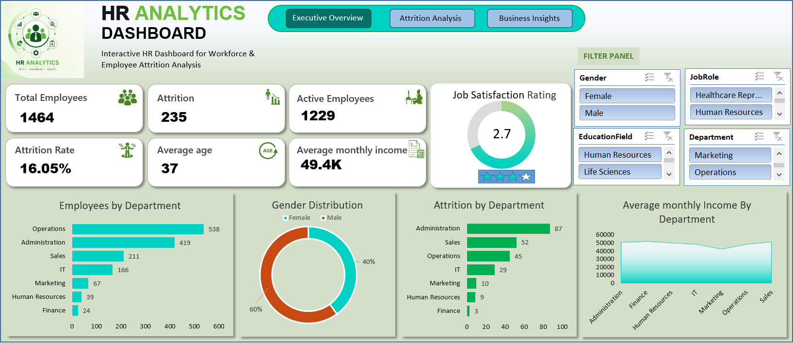
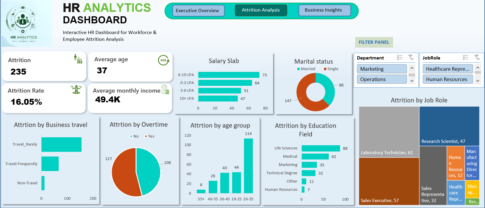
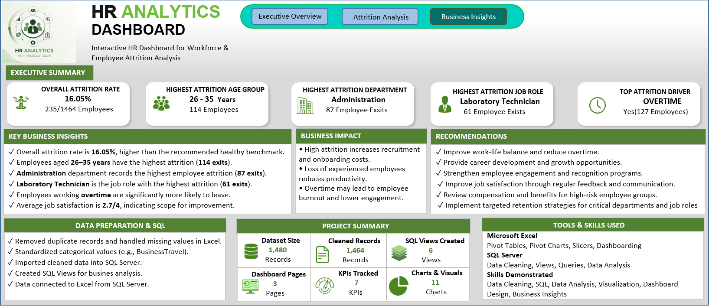

# HR Analytics Dashboard (Excel & SQL)

## 📌 Project Overview

This project presents an interactive HR Analytics Dashboard built using Microsoft Excel and SQL Server. The dashboard helps analyze employee attrition, workforce demographics, salary distribution, job satisfaction, and other HR metrics to support business decision-making.

---

## Objectives

- Analyze employee attrition trends
- Identify high-risk departments and job roles
- Track workforce KPIs
- Generate actionable business insights
- Build an interactive Excel dashboard connected with SQL-processed data

---

## 🛠 Tools & Technologies

- Microsoft Excel
- SQL Server
- Pivot Tables
- Pivot Charts
- Slicers
- Conditional Formatting

---

## 🔄 Data Preparation

- Removed duplicate records
- Cleaned and standardized categorical values
- Validated dataset quality
- Imported cleaned dataset into SQL Server
- Performed SQL-based exploratory analysis
- Connected SQL data to Excel for dashboard creation

---

## 📊 Dashboard Pages

### 1️⃣ Executive Overview

- Total Employees
- Active Employees
- Attrition Count
- Attrition Rate
- Average Age
- Average Monthly Income
- Job Satisfaction
- Department-wise Employee Distribution
- Gender Distribution

---

### 2️⃣ Attrition Analysis

- Attrition by Job Role
- Attrition by Department
- Attrition by Business Travel
- Attrition by Overtime
- Attrition by Salary Slab
- Attrition by Education Field
- Attrition by Age Group
- Marital Status Analysis

---

### 3️⃣ Business Insights

- Executive Summary
- Key Business Insights
- Business Impact
- Recommendations
- Project Summary
- Data Preparation Summary

---

## Key KPIs

- Total Employees
- Active Employees
- Attrition Count
- Attrition Rate
- Average Age
- Average Monthly Income
- Job Satisfaction Rating

---

## 📊 Key Business Insights

- Overall attrition rate is 16.05%.
- Employees aged 26–35 have the highest attrition.
- Administration department records the highest attrition.
- Laboratory Technician is the highest attrition job role.
- Employees working overtime are more likely to leave.

---
## 📊 Dashboard Preview

### 🏠 Executive Overview


###  Attrition Analysis


### Business Insights



## Repository Structure

```text
Dashboard/
Dataset/
SQL/
Images/
README.md
```

---

## Connect With me

**Gitasri Das**
- GitHub: https://github.com/gitasri-das
- LinkedIn: www.linkedin.com/in/gitasri-das


